# BlazeTransport Architecture

## System Architecture

BlazeTransport uses a layered architecture with clear separation between application, transport, and network layers.

```mermaid
flowchart LR
    App[Application Code] --> Stream[BlazeStream]
    Stream --> ConnMgr[ConnectionManager]
    ConnMgr --> PacketEng[PacketEngine]
    PacketEng --> UDP[(UDP Socket)]
    UDP --> RemotePeer[Peer]
    
    style App fill:#1e1e1e,stroke:#ccc
    style Stream fill:#222,stroke:#ccc
    style ConnMgr fill:#262626,stroke:#ccc
    style PacketEng fill:#2a2a2a,stroke:#ccc
    style UDP fill:#2e2e2e,stroke:#ccc
    style RemotePeer fill:#1e1e1e,stroke:#ccc
```



### Layer Responsibilities

**Application Layer** (`BlazeStream`):
- Type-safe message encoding/decoding
- Stream lifecycle management
- Error handling and recovery

**Transport Layer** (`ConnectionManager`):
- Connection state management
- Stream multiplexing and routing
- Reliability and retransmission
- Congestion control
- Security and encryption

**Network Layer** (`PacketEngine`):
- UDP socket abstraction
- Packet serialization/deserialization
- Network I/O and error handling

## Data Flow

### Send Path

1. **Application Layer**: Client calls `BlazeStream.send()` with a `Codable` value
2. **Encoding Layer**: `BlazeBinaryHelpers.encode()` serializes the value using BlazeBinary
3. **Transport Layer**: `ConnectionManager.send()` routes data to the appropriate stream
4. **Stream Management**: `StreamManager.handleAppSend()` processes the send event through the stream FSM
5. **Reliability**: `ReliabilityEngine` assigns a packet number and tracks the packet as in-flight
6. **Congestion Control**: `CongestionController` checks the congestion window and allows/queues the packet
7. **Network Layer**: `PacketEngine.send()` serializes the packet and sends it via UDP
8. **Physical Network**: Packet transmitted over UDP to the remote host

### Receive Path

1. **Physical Network**: Packet received via UDP socket
2. **Network Layer**: `PacketEngine` deserializes the packet and passes it to the handler
3. **Transport Layer**: `ConnectionManager.handleInboundPacket()` routes the packet by streamID
4. **Stream Management**: `StreamManager.handleFrameReceived()` processes the receive event through the stream FSM
5. **Buffering**: `StreamBuffer.deliver()` delivers data to the stream's AsyncStream
6. **Application Layer**: `BlazeStream.receive()` receives data from the AsyncStream
7. **Decoding Layer**: `BlazeBinaryHelpers.decode()` deserializes the data using BlazeBinary
8. **Client**: Application receives the decoded `Codable` value

## Component Overview

### ConnectionManager (Actor)

Central orchestrator managing:
- Connection state machine
- Stream lifecycle
- Packet routing
- Reliability tracking
- Congestion control
- Security management

### StreamManager (Actor)

Manages per-stream state machines:
- Stream ID allocation
- Stream state transitions
- Frame routing to streams

### PacketEngine (Actor)

UDP socket abstraction:
- Socket binding and management
- Packet send/receive
- Error handling
- Graceful shutdown

### ReliabilityEngine

Tracks packet reliability:
- Packet numbering
- In-flight packet tracking
- RTT estimation (QUIC-style)
- Selective ACK ranges

### CongestionController

Manages congestion window:
- AIMD algorithm
- Slow-start phase
- Congestion avoidance phase
- Pacing control (stub)

### SecurityManager

Handles security:
- Key rotation
- Nonce management
- Replay protection
- AEAD encryption/decryption

## Packet Structure

### Packet Header

```
+------------------+
| Version (1 byte) |
+------------------+
| Flags (1 byte)   |
+------------------+
| Connection ID    |
| (4 bytes)        |
+------------------+
| Packet Number    |
| (4 bytes)         |
+------------------+
| Stream ID        |
| (4 bytes)         |
+------------------+
| Payload Length   |
| (2 bytes)        |
+------------------+
| Payload (var)    |
+------------------+
```

Total header size: 17 bytes

### Frame Types

- `data`: Application data frame
- `ack`: Acknowledgment frame with selective ACK ranges
- `ping`: Keepalive ping
- `pong`: Keepalive pong response
- `reset`: Stream reset
- `handshake`: Cryptographic handshake

## Stream Multiplexing

BlazeTransport supports multiple concurrent streams per connection:

- Each stream has a unique 32-bit stream ID
- Streams operate independently (no head-of-line blocking)
- Streams can be opened, used, and closed independently
- Up to 32 concurrent streams per connection (configurable)

## Reliability

### Packet Tracking

- Each packet assigned a unique sequence number
- In-flight packets tracked with send timestamps
- ACK frames acknowledge received packets
- Selective ACK (SACK) supports range-based acknowledgments

### Retransmission

- Packets timeout after RTO (Retransmission Timeout)
- RTO calculated as `srtt + 4 * rttvar`
- Retransmitted packets use original packet number
- Duplicate ACKs trigger fast retransmit (future)

### RTT Estimation

QUIC-style RTT estimation:
- `srtt`: Smoothed RTT (exponential moving average)
- `rttvar`: RTT variance
- `minRtt`: Minimum observed RTT
- Updated on each ACK received

## Congestion Control

### AIMD Algorithm

**Slow Start Phase** (window < ssthresh):
- Window grows exponentially: `cwnd += bytesAcked`
- Fast ramp-up for new connections

**Congestion Avoidance Phase** (window >= ssthresh):
- Window grows linearly: `cwnd += (MSS * MSS) / cwnd`
- Conservative growth to avoid congestion

**On Loss**:
- Window cut in half: `cwnd = cwnd / 2`
- Update ssthresh: `ssthresh = max(cwnd / 2, 1460)`

### Pacing

Token bucket pacing (stub implementation):
- Currently unlimited rate (1 GB/s default)
- Future: Configurable pacing rate based on congestion window

## Security

### Encryption

- All payload data encrypted with ChaCha20-Poly1305 AEAD
- Packet headers remain unencrypted (for routing)
- Authentication tags on every packet

### Key Exchange

- X25519 elliptic curve Diffie-Hellman
- Ephemeral keys for each connection
- Perfect Forward Secrecy

### Key Rotation

- Automatic rotation after 1M packets or 1 hour
- Nonce counter resets on rotation
- Replay window cleared on rotation

See [SecurityModel.md](SecurityModel.md) for detailed security documentation.

