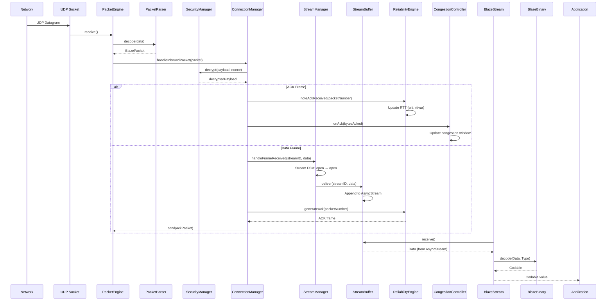
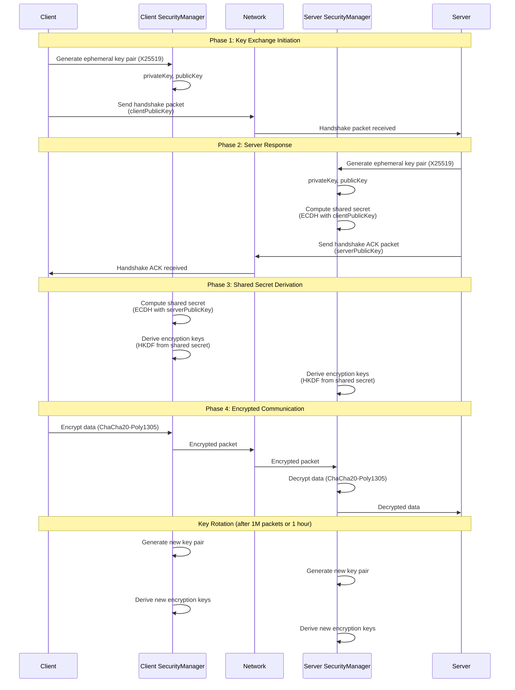

# BlazeTransport Internals

This document describes the internal implementation details of BlazeTransport. For architecture overview, see [Architecture.md](Architecture.md).

## Package Structure

### Public API

- `BlazeTransport.swift`: Main entry point, error types, configuration
- `BlazeConnection.swift`: Connection protocol and implementation
- `BlazeStream.swift`: Stream protocol and implementation

### Internal Engine

- `PacketHeader.swift`: Packet header structure
- `FrameTypes.swift`: Frame type definitions
- `PacketParser.swift`: Packet encoding/decoding
- `PacketEngine.swift`: UDP socket abstraction (actor)
- `ConnectionFSM.swift`: Connection state machine
- `StreamManager.swift`: Stream lifecycle management (actor)
- `StreamBuffer.swift`: Per-stream data buffering (actor)
- `ReliabilityEngine.swift`: Packet tracking and RTT estimation
- `CongestionController.swift`: AIMD congestion control
- `ConnectionManager.swift`: Main orchestrator (actor)
- `BlazeBinaryHelpers.swift`: BlazeBinary encoding/decoding helpers
- `SecurityManager.swift`: Key rotation and replay protection
- `ConnectionMigration.swift`: Address change tracking
- `StreamPriority.swift`: Priority queue for stream scheduling
- `PacketCoalescer.swift`: Packet batching within MTU

## Dependencies

- **BlazeBinary**: Encoding/decoding and encryption
- **BlazeFSM**: State machine framework
- **BlazeDB**: Optional protocol-based hooks

## Implementation Details

### Actor Isolation

BlazeTransport uses Swift actors for thread-safe state management:

- `ConnectionManager`: Manages connection state and packet routing
- `PacketEngine`: Handles UDP socket I/O
- `StreamManager`: Manages per-stream state machines
- `StreamBuffer`: Buffers data for each stream

All actors use `async` methods and proper isolation to prevent data races.

### Packet Format

Packets have a fixed 17-byte header:

```
+------------------+
| Version (1 byte) |
+------------------+
| Flags (1 byte)   |
+------------------+
| Connection ID    |
| (4 bytes)        |
+------------------+
| Packet Number    |
| (4 bytes)         |
+------------------+
| Stream ID        |
| (4 bytes)         |
+------------------+
| Payload Length   |
| (2 bytes)        |
+------------------+
| Payload (var)    |
+------------------+
```

### Frame Format

Frames are encoded within packet payloads:

```
+------------------+
| Frame Type       |
| (1 byte)         |
+------------------+
| Frame Data       |
| (var)            |
+------------------+
```

### Reliability

Packet reliability is tracked using:

- **Packet Numbers**: Sequential numbering starting at 1
- **In-Flight Tracking**: Dictionary of packet number → send time
- **RTT Estimation**: QUIC-style smoothed RTT calculation
- **Selective ACK**: Compressed ACK ranges for efficiency

### Congestion Control

AIMD algorithm implementation:

- **Slow Start**: Exponential window growth (`cwnd += bytesAcked`)
- **Congestion Avoidance**: Linear growth (`cwnd += (MSS * MSS) / cwnd`)
- **On Loss**: Window cut in half (`cwnd = cwnd / 2`)

### Security

Security is handled by `SecurityManager`:

- **Key Rotation**: Automatic after 1M packets or 1 hour
- **Nonce Management**: 64-bit nonce per packet, increments on send
- **Replay Protection**: 1000-packet window tracks seen nonces

### Stream Management

Streams are managed by `StreamManager`:

- **Stream ID Allocation**: Sequential starting at 1
- **State Machines**: Per-stream FSM tracks stream lifecycle
- **Priority Queue**: Weight-based scheduling for fair processing

### Error Handling

Errors are handled at multiple levels:

- **Network Errors**: Caught by `PacketEngine`, propagated as `BlazeTransportError.underlying`
- **Protocol Errors**: Handled by `ConnectionManager`, may close connection
- **Application Errors**: Encoding/decoding errors propagated to application
- **Security Errors**: Silently handled to prevent information leakage

## Testing

Test coverage includes:

- **Unit Tests**: Individual component testing
- **Integration Tests**: End-to-end message delivery
- **State Machine Tests**: FSM transition validation
- **Security Tests**: AEAD, replay protection, key rotation
- **Performance Tests**: Benchmark suite

## Performance Considerations

### Memory

- **Connection Overhead**: ~10KB per connection
- **Stream Overhead**: ~1KB per stream
- **Packet Buffering**: Limited by congestion window
- **Replay Window**: 1000 nonces × 8 bytes = ~8KB

### CPU

- **Encoding/Decoding**: CPU-bound, optimized with BlazeBinary
- **RTT Calculation**: O(1) per ACK
- **ACK Range Processing**: O(n) where n is number of ranges
- **State Machine Processing**: O(1) per transition

### Network

- **Packet Overhead**: 17 bytes header + frame type byte
- **ACK Overhead**: Minimal, uses selective ACK ranges
- **Retransmission**: Only on timeout, not duplicate ACKs (future)

## Detailed Implementation Flows

### Data Flow: Receive Path



### Security Handshake Flow



### Reliability and Retransmission Flow

```mermaid
flowchart TD
    Start[Packet Sent] --> Track[ReliabilityEngine.notePacketSent]
    Track --> InFlight[Add to in-flight queue]
    InFlight --> Timer[Start RTO timer]
    
    Timer --> Wait{Wait for ACK}
    
    Wait -->|ACK Received| ACK[ReliabilityEngine.noteAckReceived]
    ACK --> UpdateRTT[Update RTT: srtt, rttvar, minRtt]
    UpdateRTT --> Remove[Remove from in-flight]
    Remove --> Congestion[CongestionController.onAck]
    Congestion --> End1[Success]
    
    Wait -->|Timeout| Timeout[Check RTO: srtt + 4*rttvar]
    Timeout --> Retransmit[Retransmit packet]
    Retransmit --> CongestionLoss[CongestionController.onLoss]
    CongestionLoss --> ReduceWindow[Reduce congestion window]
    ReduceWindow --> UpdateSsthresh[Update ssthresh]
    UpdateSsthresh --> InFlight
    
    Wait -->|Duplicate ACK| DupACK[Fast Retransmit Trigger]
    DupACK --> Retransmit
    
    style Start fill:#1e1e1e,stroke:#4a9eff
    style ACK fill:#2a2a2a,stroke:#51cf66
    style Retransmit fill:#2a2a2a,stroke:#ff6b6b
    style End1 fill:#262626,stroke:#51cf66
```



### Congestion Control Flow

```mermaid
flowchart TD
    Start[Connection Established] --> Init[Initialize: cwnd = 1460, ssthresh = 65535]
    Init --> Check{Check Phase}
    
    Check -->|cwnd < ssthresh| SlowStart[Slow Start Phase]
    Check -->|cwnd >= ssthresh| CongAvoid[Congestion Avoidance Phase]
    
    SlowStart --> OnAck[onAck: bytesAcked received]
    OnAck --> GrowExp[cwnd += bytesAcked<br/>Exponential growth]
    GrowExp --> Check
    
    CongAvoid --> OnAck2[onAck: bytesAcked received]
    OnAck2 --> GrowLin[cwnd += MSS²/cwnd<br/>Linear growth]
    GrowLin --> Check
    
    OnAck --> OnLoss[onLoss: Packet loss detected]
    OnLoss --> Reduce[cwnd = cwnd / 2<br/>ssthresh = larger of cwnd/2 or 1460]
    Reduce --> Check
    
    Check --> WindowCheck{cwnd > 0?}
    WindowCheck -->|Yes| Allow[Allow packet transmission]
    WindowCheck -->|No| Queue[Queue packet]
    
    Allow --> Pacing[Pacing: Token bucket]
    Pacing --> Send[Send packet]
    Queue --> Wait[Wait for window space]
    Wait --> Check
    
    style Start fill:#1e1e1e,stroke:#4a9eff
    style SlowStart fill:#2a2a2a,stroke:#ffd43b
    style CongAvoid fill:#2a2a2a,stroke:#51cf66
    style OnLoss fill:#2a2a2a,stroke:#ff6b6b
    style Send fill:#262626,stroke:#51cf66
```



## Future Improvements

Planned improvements for future versions:

- **0-RTT Handshakes**: Reduce connection establishment latency
- **Fast Retransmit**: Retransmit on duplicate ACKs, not just timeout
- **Advanced Congestion Control**: BBR, CUBIC algorithms
- **Certificate-Based Auth**: Replace simplified X25519 handshake
- **IPv6 Support**: Native IPv6 socket support
- **Kernel Bypass**: DPDK or similar for higher performance

