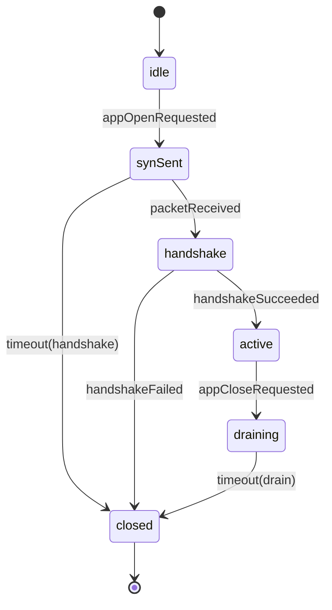
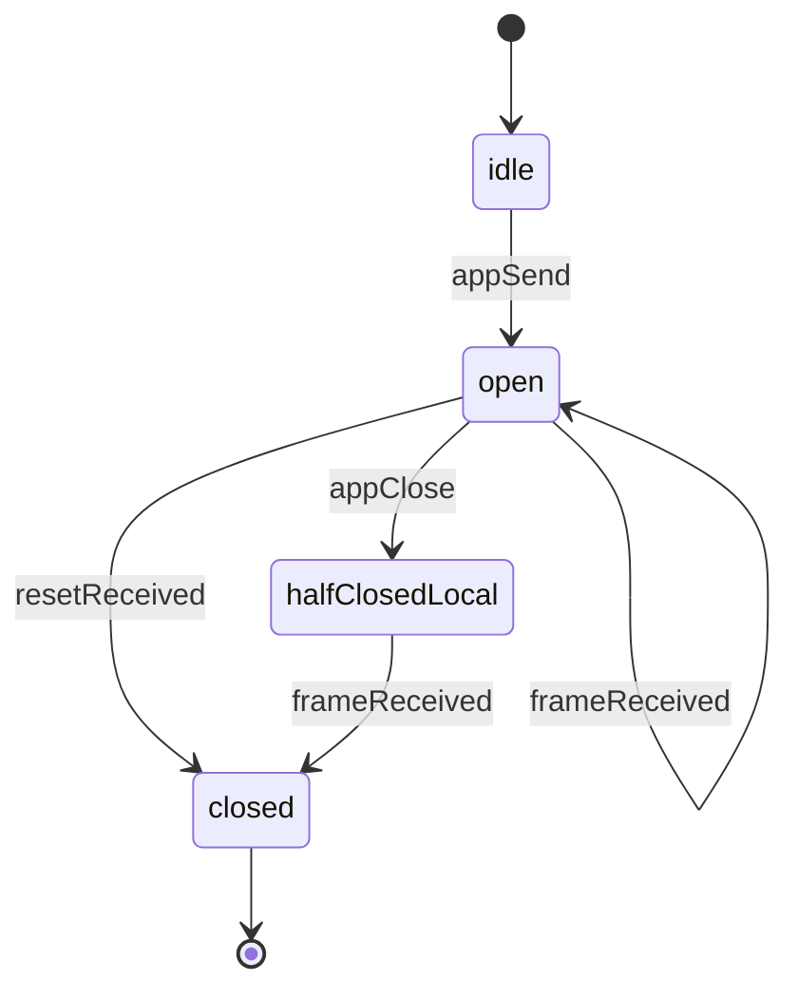

# BlazeTransport State Machines

BlazeTransport uses BlazeFSM to model connection and stream lifecycles. This document describes the state machines and their transitions.

## Connection State Machine

The connection state machine manages the lifecycle of a BlazeTransport connection.

### States

- **idle**: Initial state, connection not yet established
- **synSent**: Connection initiation sent, waiting for response
- **handshake**: Cryptographic handshake in progress
- **active**: Connection established and ready for data transfer
- **draining**: Connection closing, finishing in-flight operations
- **closed**: Connection terminated

### Transitions

```
idle + appOpenRequested → synSent
  Effects: [sendPacket(handshake), startTimer(handshake), markHandshakeStarted]

synSent + packetReceived → handshake
  Effects: [sendPacket(handshake-ack)]

synSent + timeout(handshake) → closed
  Effects: [markClosed]

handshake + handshakeSucceeded → active
  Effects: [cancelTimer(handshake), markActive]

handshake + handshakeFailed → closed
  Effects: [markClosed]

active + appCloseRequested → draining
  Effects: [sendPacket(close)]

draining + timeout(drain) → closed
  Effects: [markClosed]
```

### State Diagram



## Stream State Machine

The stream state machine manages the lifecycle of individual streams within a connection.

### States

- **idle**: Stream created but not yet used
- **open**: Stream active and ready for data transfer
- **halfClosedLocal**: Local end closed, remote may still send
- **halfClosedRemote**: Remote end closed, local may still send
- **closed**: Stream terminated

### Transitions

```
idle + appSend → open
  Effects: [emitFrame(data)]

open + frameReceived → open
  Effects: [deliverToApp(data)]

open + appClose → halfClosedLocal
  Effects: [emitFrame(close-marker)]

open + resetReceived → closed
  Effects: [markClosed]

halfClosedLocal + frameReceived → closed
  Effects: [markClosed]
```

### State Diagram



## Event Matching

BlazeFSM matches events by case, not by associated values. For events with associated values (e.g., `packetReceived(BlazePacket)`), the FSM matches on the case `.packetReceived`, and the associated value is handled by the ConnectionManager or StreamManager.

## Effects

State machine transitions produce effects that are applied by the ConnectionManager:

### Connection Effects

- `sendPacket(BlazePacket)`: Send a packet on the wire
- `startTimer(String, TimeInterval)`: Start a protocol timer
- `cancelTimer(String)`: Cancel a protocol timer
- `markHandshakeStarted`: Mark handshake as started
- `markActive`: Mark connection as active
- `markClosed`: Mark connection as closed

### Stream Effects

- `emitFrame(Data)`: Send a frame on the wire
- `deliverToApp(Data)`: Deliver data to the application
- `markClosed`: Mark stream as closed

## Implementation

State machines are defined in:
- `ConnectionFSM.swift`: Connection state machine
- `StreamManager.swift`: Stream state machine (per-stream)

Both use BlazeFSM's `StateMachine` type with type parameters:
- `State`: The state type (e.g., `ConnectionState`)
- `Event`: The event type (e.g., `ConnectionEvent`)
- `Effect`: The effect type (e.g., `ConnectionEffect`)

