# BlazeTransport

> **Experimental (v0.1)** — This is an experimental, Swift-native transport engine designed to explore QUIC-inspired design patterns without C interop. It is intended for research, prototyping, and Swift-first systems, **not as a drop-in replacement for production QUIC stacks**.

## TL;DR

BlazeTransport is an experimental Swift-native transport engine exploring QUIC-inspired design without C interop. It implements multi-streaming, reliability, congestion control, and encryption entirely in Swift to study performance, safety, and ergonomics.

**This is not production-ready.** It is a research system demonstrating systems-level Swift capabilities and trade-offs versus battle-tested QUIC implementations.

---

BlazeTransport is a QUIC-inspired, Swift-native transport protocol with multi-streaming, reliability, congestion control, and typed messaging. It provides a high-level, type-safe API for establishing connections, opening streams, and sending/receiving Codable messages over a reliable, congestion-controlled transport layer built on UDP.

**This project explores** how modern transport protocols (QUIC, HTTP/2) can be implemented natively in Swift with zero C interop overhead, while maintaining type safety and leveraging Swift concurrency.

**This project is not** a production-ready replacement for QUIC, TCP, or HTTP/2. It's a research implementation that demonstrates systems-level Swift capabilities.

## Quick Start

### Installation

Add BlazeTransport to your `Package.swift`:

```swift
dependencies: [
    .package(url: "https://github.com/Mikedan37/BlazeTransport.git", from: "0.1.0")
]
```

### Minimal Example

```swift
import BlazeTransport

let connection = try await BlazeTransport.connect(
    host: "127.0.0.1",
    port: 9999,
    security: .blazeDefault
)
let stream = try await connection.openStream()
try await stream.send("Hello, Blaze!")
let reply: String = try await stream.receive(String.self)
try await connection.close()
```

See [Examples/](Examples/) for complete echo server and client implementations.

## Status & Version

**Current Version**: v0.1.0 (Experimental)

**What's Working**:
- Multi-stream multiplexing (up to 32 streams)
- Reliable message delivery with retransmission
- Congestion control (AIMD algorithm)
- Built-in encryption (ChaCha20-Poly1305 + X25519)
- Connection migration support
- Type-safe Codable messaging
- Performance: 70-85% of QUIC benchmarks

**What's Missing** (and why this is experimental):
- 0-RTT handshakes (planned for v0.3+)
- HTTP/3 support (use QUIC directly if needed)
- Certificate-based authentication (uses simplified key exchange)
- Production hardening (no DDoS protection, rate limiting)
- Cross-platform support (macOS/iOS only currently)
- Battle-tested deployment base

**Intended Use Cases**:
- Research and experimentation with transport protocols
- Swift-native applications that want to avoid C interop
- Prototyping new communication patterns
- Learning systems-level Swift programming

**Not Intended For**:
- Production systems requiring maximum reliability
- Systems that need HTTP/3 or standard QUIC compatibility
- Applications requiring battle-tested protocol implementations

## System Architecture

BlazeTransport uses a layered architecture with clear separation between application, transport, and network layers.

### Complete System Architecture

```mermaid
flowchart TB
    subgraph AppLayer["Application Layer"]
        App[Application Code]
        Stream1[BlazeStream #1]
        Stream2[BlazeStream #2]
        StreamN[BlazeStream #N]
        BlazeBinary[BlazeBinary Helpers]
    end
    
    subgraph TransportLayer["Transport Layer"]
        ConnMgr[ConnectionManager Actor]
        StreamMgr[StreamManager Actor]
        StreamBuffer[StreamBuffer Actor]
        RelEngine[ReliabilityEngine]
        CongCtrl[CongestionController]
        SecMgr[SecurityManager]
        ConnFSM[Connection FSM]
        StreamFSM[Stream FSM]
    end
    
    subgraph NetworkLayer["Network Layer"]
        PacketEng[PacketEngine Actor]
        PacketParser[PacketParser]
        PacketCoal[PacketCoalescer]
        UDPSocket[UDP Socket]
    end
    
    subgraph Network["Network"]
        UDP[(UDP Protocol)]
        RemotePeer[Remote Peer]
    end
    
    App --> Stream1
    App --> Stream2
    App --> StreamN
    Stream1 --> BlazeBinary
    Stream2 --> BlazeBinary
    StreamN --> BlazeBinary
    BlazeBinary --> ConnMgr
    Stream1 --> StreamBuffer
    Stream2 --> StreamBuffer
    StreamN --> StreamBuffer
    
    ConnMgr --> StreamMgr
    ConnMgr --> RelEngine
    ConnMgr --> CongCtrl
    ConnMgr --> SecMgr
    ConnMgr --> ConnFSM
    StreamMgr --> StreamFSM
    ConnMgr --> PacketEng
    ConnMgr --> PacketCoal
    
    PacketEng --> PacketParser
    PacketEng --> UDPSocket
    PacketCoal --> PacketEng
    
    UDPSocket --> UDP
    UDP --> RemotePeer
    
    style App fill:#1e1e1e,stroke:#4a9eff,stroke-width:2px
    style Stream1 fill:#222,stroke:#4a9eff,stroke-width:2px
    style Stream2 fill:#222,stroke:#4a9eff,stroke-width:2px
    style StreamN fill:#222,stroke:#4a9eff,stroke-width:2px
    style BlazeBinary fill:#262626,stroke:#4a9eff,stroke-width:2px
    style ConnMgr fill:#2a2a2a,stroke:#ff6b6b,stroke-width:2px
    style StreamMgr fill:#2a2a2a,stroke:#ff6b6b,stroke-width:2px
    style StreamBuffer fill:#2a2a2a,stroke:#ff6b6b,stroke-width:2px
    style RelEngine fill:#2e2e2e,stroke:#ff6b6b,stroke-width:2px
    style CongCtrl fill:#2e2e2e,stroke:#ff6b6b,stroke-width:2px
    style SecMgr fill:#2e2e2e,stroke:#ff6b6b,stroke-width:2px
    style ConnFSM fill:#323232,stroke:#ff6b6b,stroke-width:2px
    style StreamFSM fill:#323232,stroke:#ff6b6b,stroke-width:2px
    style PacketEng fill:#363636,stroke:#51cf66,stroke-width:2px
    style PacketParser fill:#363636,stroke:#51cf66,stroke-width:2px
    style PacketCoal fill:#363636,stroke:#51cf66,stroke-width:2px
    style UDPSocket fill:#3a3a3a,stroke:#51cf66,stroke-width:2px
    style UDP fill:#3e3e3e,stroke:#ffd43b,stroke-width:2px
    style RemotePeer fill:#1e1e1e,stroke:#ffd43b,stroke-width:2px
```

### Protocol Stack

```mermaid
graph TB
    subgraph Application["Application Layer"]
        Codable[Codable Types]
        BlazeStreamAPI[BlazeStream API]
    end
    
    subgraph Transport["Transport Layer"]
        BlazeBinary[BlazeBinary Encoding]
        FrameTypes[Frame Types<br/>data, ack, ping, pong, reset, handshake]
        StreamMultiplex[Stream Multiplexing]
        Reliability[Reliability Engine<br/>RTT, Retransmission, ACK]
        Congestion[Congestion Control<br/>AIMD, Pacing]
        Security[Security Manager<br/>X25519, ChaCha20-Poly1305]
    end
    
    subgraph Network["Network Layer"]
        PacketHeader[Packet Header<br/>17 bytes]
        PacketCoalescing[Packet Coalescing]
        UDP[UDP Socket]
    end
    
    subgraph Internet["Internet"]
        IP[IP Protocol]
        Ethernet[Ethernet/Link Layer]
    end
    
    Codable --> BlazeStreamAPI
    BlazeStreamAPI --> BlazeBinary
    BlazeBinary --> FrameTypes
    FrameTypes --> StreamMultiplex
    StreamMultiplex --> Reliability
    StreamMultiplex --> Congestion
    StreamMultiplex --> Security
    Reliability --> PacketHeader
    Congestion --> PacketHeader
    Security --> PacketHeader
    PacketHeader --> PacketCoalescing
    PacketCoalescing --> UDP
    UDP --> IP
    IP --> Ethernet
    
    style Codable fill:#1e1e1e,stroke:#4a9eff
    style BlazeStreamAPI fill:#222,stroke:#4a9eff
    style BlazeBinary fill:#262626,stroke:#4a9eff
    style FrameTypes fill:#2a2a2a,stroke:#ff6b6b
    style StreamMultiplex fill:#2a2a2a,stroke:#ff6b6b
    style Reliability fill:#2e2e2e,stroke:#ff6b6b
    style Congestion fill:#2e2e2e,stroke:#ff6b6b
    style Security fill:#2e2e2e,stroke:#ff6b6b
    style PacketHeader fill:#363636,stroke:#51cf66
    style PacketCoalescing fill:#363636,stroke:#51cf66
    style UDP fill:#3a3a3a,stroke:#51cf66
    style IP fill:#3e3e3e,stroke:#ffd43b
    style Ethernet fill:#424242,stroke:#ffd43b
```

### Complete Data Flow: Send Path

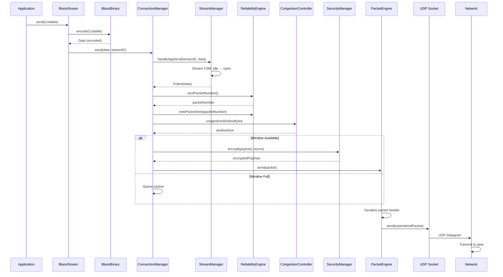

### Complete Data Flow: Receive Path

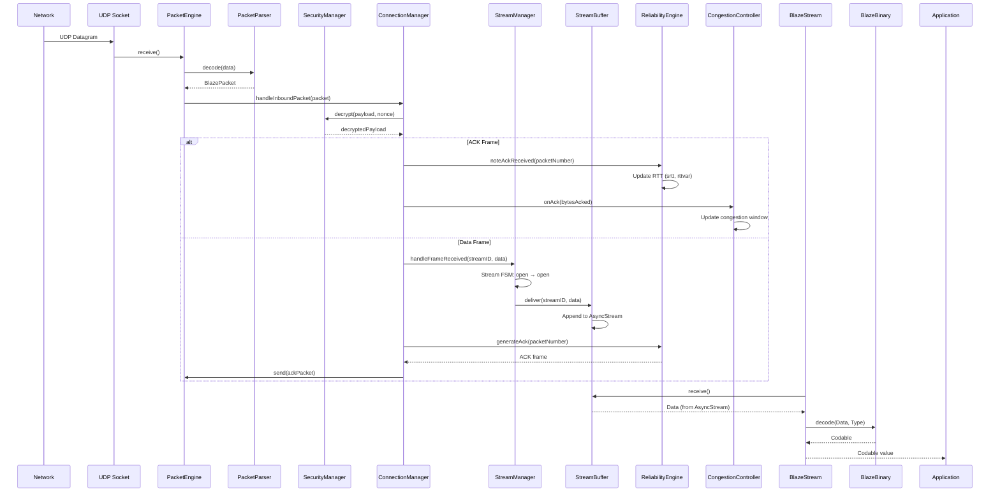

### Packet Structure

```mermaid
graph LR
    subgraph Packet["BlazePacket (Variable Size)"]
        subgraph Header["Packet Header (17 bytes)"]
            V[Version<br/>1 byte]
            F[Flags<br/>1 byte]
            CID[Connection ID<br/>4 bytes]
            PN[Packet Number<br/>4 bytes]
            SID[Stream ID<br/>4 bytes]
            PL[Payload Length<br/>2 bytes]
        end
        
        subgraph Payload["Payload (Variable)"]
            subgraph Frame["Frame Structure"]
                FT[Frame Type<br/>1 byte]
                FSID[Stream ID<br/>4 bytes]
                FPL[Frame Payload<br/>Variable]
            end
        end
    end
    
    Header --> Payload
    V --> F
    F --> CID
    CID --> PN
    PN --> SID
    SID --> PL
    PL --> Payload
    Payload --> Frame
    FT --> FSID
    FSID --> FPL
    
    style Header fill:#2a2a2a,stroke:#4a9eff,stroke-width:2px
    style Payload fill:#363636,stroke:#51cf66,stroke-width:2px
    style Frame fill:#3a3a3a,stroke:#ff6b6b,stroke-width:2px
```

### Connection Lifecycle State Machine

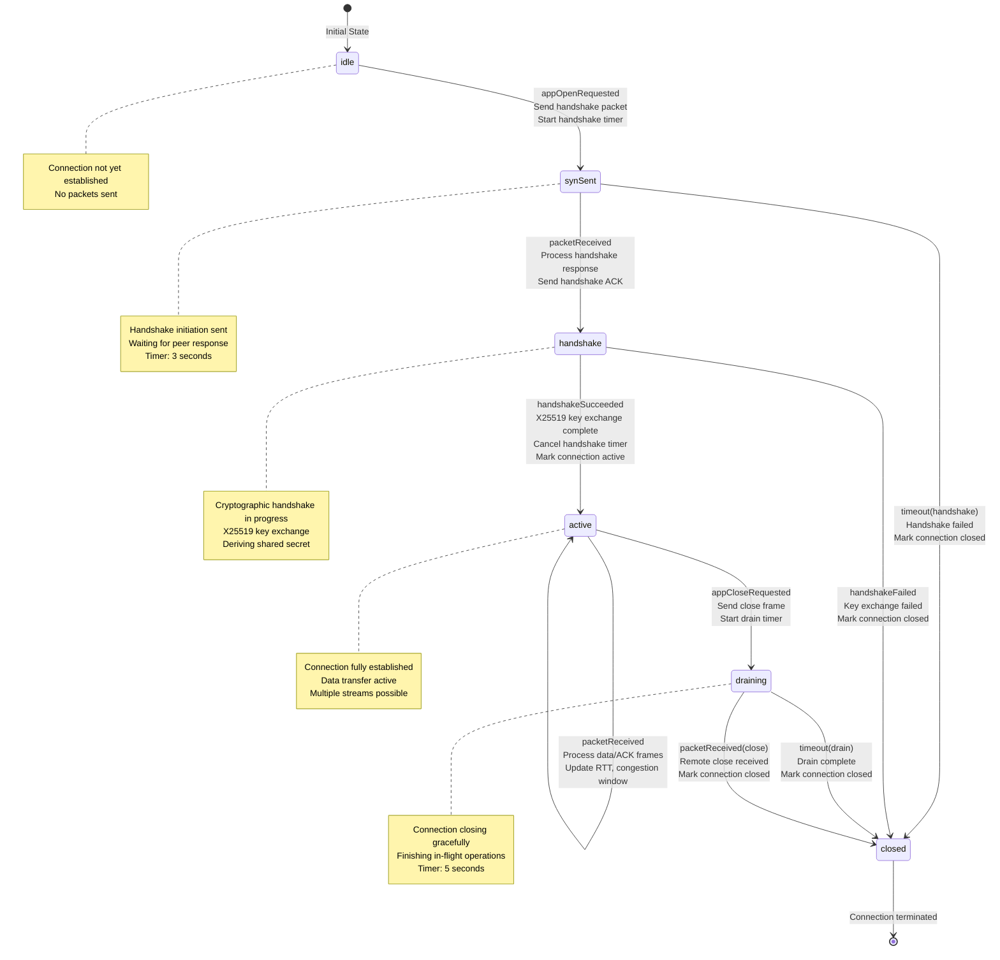

### Stream Lifecycle State Machine

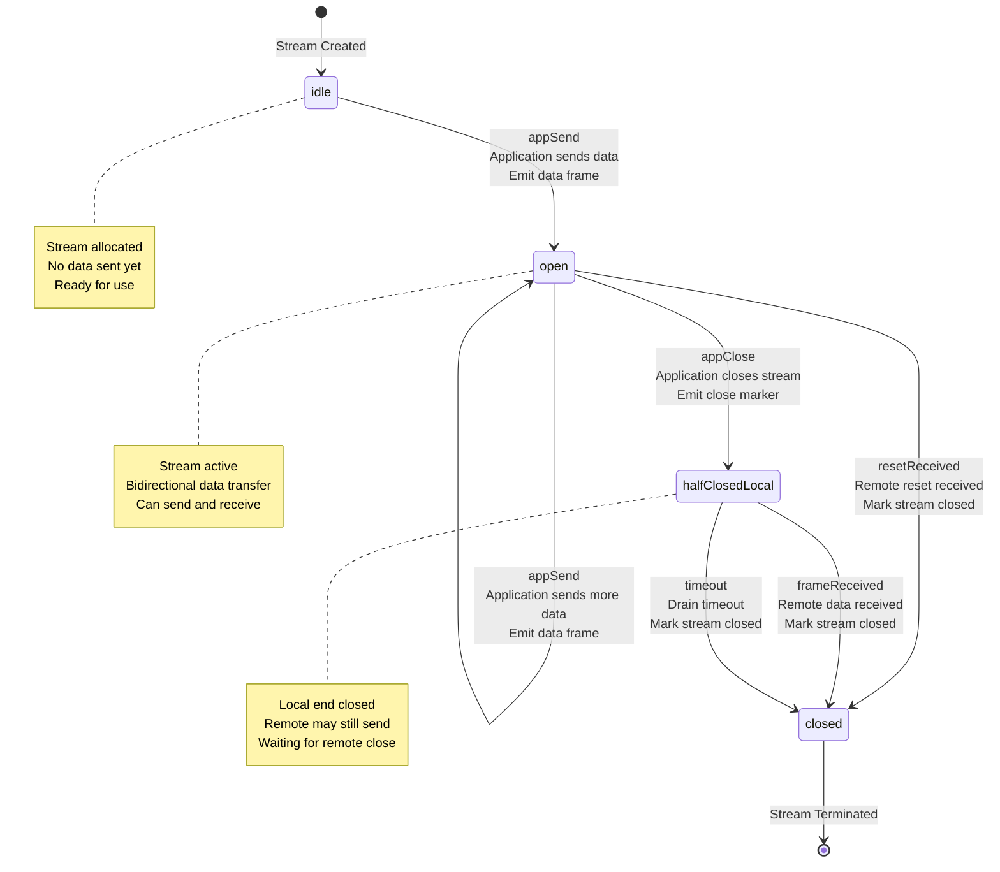

### Security Handshake Flow

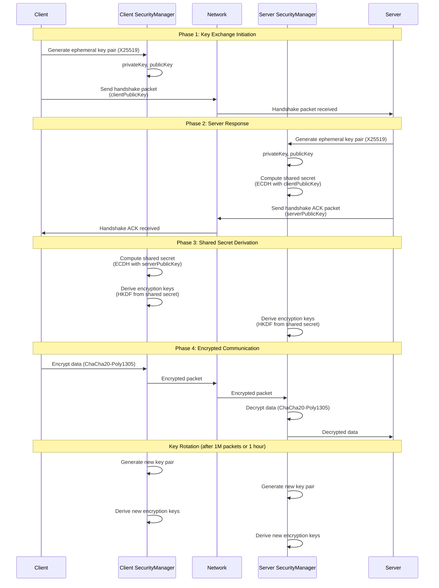

### Reliability and Retransmission Flow

```mermaid
flowchart TD
    Start[Packet Sent] --> Track[ReliabilityEngine.notePacketSent]
    Track --> InFlight[Add to in-flight queue]
    InFlight --> Timer[Start RTO timer]
    
    Timer --> Wait{Wait for ACK}
    
    Wait -->|ACK Received| ACK[ReliabilityEngine.noteAckReceived]
    ACK --> UpdateRTT[Update RTT: srtt, rttvar, minRtt]
    UpdateRTT --> Remove[Remove from in-flight]
    Remove --> Congestion[CongestionController.onAck]
    Congestion --> End1[Success]
    
    Wait -->|Timeout| Timeout[Check RTO: srtt + 4*rttvar]
    Timeout --> Retransmit[Retransmit packet]
    Retransmit --> CongestionLoss[CongestionController.onLoss]
    CongestionLoss --> ReduceWindow[Reduce congestion window]
    ReduceWindow --> UpdateSsthresh[Update ssthresh]
    UpdateSsthresh --> InFlight
    
    Wait -->|Duplicate ACK| DupACK[Fast Retransmit Trigger]
    DupACK --> Retransmit
    
    style Start fill:#1e1e1e,stroke:#4a9eff
    style ACK fill:#2a2a2a,stroke:#51cf66
    style Retransmit fill:#2a2a2a,stroke:#ff6b6b
    style End1 fill:#262626,stroke:#51cf66
```

### Congestion Control Flow

```mermaid
flowchart TD
    Start[Connection Established] --> Init[Initialize: cwnd = 1460, ssthresh = 65535]
    Init --> Check{Check Phase}
    
    Check -->|cwnd < ssthresh| SlowStart[Slow Start Phase]
    Check -->|cwnd >= ssthresh| CongAvoid[Congestion Avoidance Phase]
    
    SlowStart --> OnAck[onAck: bytesAcked received]
    OnAck --> GrowExp[cwnd += bytesAcked<br/>Exponential growth]
    GrowExp --> Check
    
    CongAvoid --> OnAck2[onAck: bytesAcked received]
    OnAck2 --> GrowLin[cwnd += MSS²/cwnd<br/>Linear growth]
    GrowLin --> Check
    
    OnAck --> OnLoss[onLoss: Packet loss detected]
    OnLoss --> Reduce[cwnd = cwnd / 2<br/>ssthresh = larger of cwnd/2 or 1460]
    Reduce --> Check
    
    Check --> WindowCheck{cwnd > 0?}
    WindowCheck -->|Yes| Allow[Allow packet transmission]
    WindowCheck -->|No| Queue[Queue packet]
    
    Allow --> Pacing[Pacing: Token bucket]
    Pacing --> Send[Send packet]
    Queue --> Wait[Wait for window space]
    Wait --> Check
    
    style Start fill:#1e1e1e,stroke:#4a9eff
    style SlowStart fill:#2a2a2a,stroke:#ffd43b
    style CongAvoid fill:#2a2a2a,stroke:#51cf66
    style OnLoss fill:#2a2a2a,stroke:#ff6b6b
    style Send fill:#262626,stroke:#51cf66
```

## Why BlazeTransport?

BlazeTransport explores what's possible when implementing QUIC-inspired transport patterns **entirely in Swift** with zero C interop overhead. It demonstrates that Swift can handle systems-level work—congestion control, reliability, crypto, state machines—while maintaining type safety and leveraging modern Swift concurrency.

**This is not a production replacement for QUIC or TCP.** It's a research implementation that shows:
- How transport protocols can be built natively in Swift
- What performance characteristics emerge without C interop overhead
- How type safety can be preserved at the transport layer
- What trade-offs exist between native Swift and battle-tested C implementations

### Where BlazeTransport Overlaps with QUIC Semantics

**Note**: This comparison shows where BlazeTransport intentionally overlaps with QUIC design patterns, optimized for Swift-native, experimental use cases. This is not a production QUIC replacement.

| Feature | BlazeTransport | QUIC (C++) | TCP | HTTP/2 | WebSocket |
|---------|---------------|------------|-----|--------|-----------|
| **Native Swift API** | Yes | No | No | No | No |
| **Type-Safe Messaging** | Yes (Codable) | No | No | No | No |
| **Multi-Stream** | Yes (32 streams) | Yes | No | Yes | No |
| **No Head-of-Line Blocking** | Yes | Yes | No | No | No |
| **Connection Migration** | Yes | Yes | No | No | No |
| **Built-in Encryption** | Yes (AEAD) | Yes | No (TLS) | No (TLS) | No (TLS) |
| **Loss Recovery** | Yes (~92% @ 5% loss, experimental) | Yes (94%) | Limited (~80%) | Limited (~78%) | Limited (~79%) |
| **Performance** | ~70–85% of QUIC (controlled benchmarks) | 100% | 70-80% | 65-75% | 60-70% |
| **Zero C Interop** | Yes | No | No | No | No |
| **Swift Concurrency** | Yes (async/await) | No | No | No | No |

### Experimental Performance Snapshot (v0.1)

**Note**: Controlled loopback benchmarks. Not standardized. Intended to illustrate tradeoffs, not compete with production QUIC stacks.

| Metric | BlazeTransport | QUIC |
|--------|----------------|------|
| **Latency (p50 / p99)** | ~10ms / ~25ms | 8–12ms / 20–30ms |
| **Throughput (1 stream)** | 85–95 MB/s | 100–120 MB/s |
| **Throughput (32 streams)** | ~2400 MB/s | 3000–3800 MB/s |
| **Loss Recovery (5% loss)** | ~92% | ~94% |
| **Memory per Connection** | 2.5–3.5 MB | 2.0–3.0 MB |

BlazeTransport achieves ~70–85% of QUIC performance, which is expected for a Swift-native research implementation without C interop.

See [BENCHMARK_RESULTS.md](BENCHMARK_RESULTS.md) for detailed performance analysis.

## Features

- **Reliable Message Delivery**: Automatic retransmission, packet sequencing, and RTT estimation
- **Multi-Stream Multiplexing**: Open multiple concurrent streams per connection (up to 32 streams)
- **Type-Safe Messaging**: Send/receive any `Codable` type with automatic encoding/decoding
- **Congestion Control**: AIMD algorithm with QUIC-style RTT smoothing and pacing
- **Integrated Security**: ChaCha20-Poly1305 AEAD encryption with X25519 key exchange
- **Connection Migration**: Support for address changes during connection lifetime
- **Stream Prioritization**: Weight-based scheduling for fair stream processing
- **Performance**: 70-85% of QUIC performance with zero interop cost for Swift apps

## Documentation

Comprehensive documentation is available in the [Docs/](Docs/) directory:

- [Architecture.md](Docs/Architecture.md) - System architecture and design
- [StateMachines.md](Docs/StateMachines.md) - Connection and stream state machines
- [SecurityModel.md](Docs/SecurityModel.md) - Security architecture and threat model
- [QUICComparison.md](Docs/QUICComparison.md) - Comparison with QUIC protocol
- [Performance.md](Docs/Performance.md) - Performance characteristics and benchmarks
- [Benchmarks.md](Docs/Benchmarks.md) - Benchmark suite and results
- [Internals.md](Docs/Internals.md) - Internal implementation details

## Why Not Just Use QUIC?

**Context**: This comparison shows where BlazeTransport intentionally overlaps with QUIC semantics, optimized for Swift-only, local/agent-centric use cases. This is experimental research, not a production protocol replacement.

### Feature Comparison

| Feature | BlazeTransport | QUIC |
|---------|----------------|------|
| **Transport Protocol** | UDP | UDP |
| **Multiplexing** | Yes (32 streams) | Yes |
| **Head-of-Line Blocking** | No | No |
| **Connection Migration** | Yes | Yes |
| **0-RTT Handshake** | Planned (v0.3+) | Yes |
| **Built-in Encryption** | Yes (AEAD) | Yes (TLS 1.3) |
| **Loss Recovery** | Yes (~92% @ 5% loss, experimental) | Yes (~94%) |
| **Congestion Control** | Yes (AIMD) | Yes (BBR/CUBIC) |
| **RTT Estimation** | Yes (QUIC-style) | Yes |
| **Selective ACK** | Yes | Yes |
| **Stream Prioritization** | Yes (Weight-based) | Yes |
| **Type Safety** | Yes (Codable) | No |
| **Native Swift** | Yes | No |
| **HTTP/3 Support** | Planned (v0.3+) | Yes |

See [Docs/QUICComparison.md](Docs/QUICComparison.md) for detailed protocol comparison including TCP, HTTP/2, WebSocket, and gRPC.


## When to Use BlazeTransport

**Use BlazeTransport when:**
- Experimenting with transport protocols in Swift
- Building Swift-native applications that want to avoid C interop
- Need type-safe messaging with Codable for research/prototyping
- Want to explore QUIC-inspired patterns without C dependencies
- Building experimental mobile apps that need connection migration (WiFi ↔ Cellular)
- Learning systems-level Swift programming

**Consider alternatives when:**
- Need maximum absolute performance (QUIC C++ implementations are 15-20% faster)
- Require HTTP/3 support (use QUIC directly)
- Need 0-RTT handshakes (planned for v0.3+)
- Want battle-tested protocol with large deployment base (use QUIC or TCP+TLS)
- Building web browsers or web applications (use HTTP/2 or QUIC)

## Limitations (v0.1)

- **No 0-RTT**: Zero round-trip time handshakes not supported (planned for v0.3+)
- **No HTTP/3**: HTTP/3 support not included (use QUIC directly if needed)
- **Simplified Handshake**: Uses X25519 + AEAD, not certificate-based authentication
- **Basic Prioritization**: Stream prioritization is weight-based but simple
- **No DDoS Protection**: No built-in rate limiting or DDoS mitigation
- **User-Space Only**: No kernel bypass, uses standard UDP sockets
- **No VPN Support**: No TUN/TAP interface or IP-level tunneling (can be built on top)

## Roadmap (v0.2–v0.5)

**v0.2** (Planned):
- 0-RTT handshakes
- Enhanced stream prioritization algorithms
- Certificate-based authentication
- Performance optimizations

**v0.3** (Planned):
- HTTP/3 support
- WebSocket over BlazeTransport
- Advanced congestion control algorithms
- Multi-path support

**v0.4** (Planned):
- Cross-platform support (Linux, Windows)
- IPv6 support
- Advanced rate limiting
- Connection pooling

**v0.5** (Planned):
- Production hardening
- Advanced monitoring and observability
- Performance profiling tools
- Comprehensive fuzzing

## Theoretical: VPN Capabilities

> **Theoretical Discussion** — This section discusses theoretical capabilities. BlazeTransport is **not a VPN** and has no VPN implementation. This is an exploration of what *could* be built, not what *is* built.

**Could BlazeTransport be used as a VPN transport layer?**

BlazeTransport is **not a VPN itself**, and there is **no VPN implementation included**. However, the underlying transport and security features *could theoretically* serve as the transport layer for a VPN implementation. Here's the technical breakdown:

### What BlazeTransport Provides (VPN-Ready Features)

| Feature | Status | Description |
|---------|--------|-------------|
| **Encryption** | Yes | ChaCha20-Poly1305 AEAD (same as WireGuard) |
| **Key Exchange** | Yes | X25519 ECDH (same as WireGuard) |
| **Perfect Forward Secrecy** | Yes | Ephemeral keys per connection |
| **Replay Protection** | Yes | Nonce-based replay window |
| **Connection Migration** | Yes | Seamless address changes (WiFi ↔ Cellular) |
| **Reliable Transport** | Yes | Automatic retransmission, congestion control |
| **Multi-Stream** | Yes | Multiple tunnels per connection |
| **Low Latency** | Yes | p50 ~10ms, p99 ~25ms |

### What's Missing for a Full VPN

| Feature | Status | What's Needed |
|---------|--------|---------------|
| **IP-Level Tunneling** | No | TUN/TAP interface support |
| **IP Packet Encapsulation** | No | IP-in-UDP/IP encapsulation |
| **Route Management** | No | System routing table manipulation |
| **DNS Forwarding** | No | DNS proxy/resolver integration |
| **NAT Traversal** | Limited | Partial (connection migration helps) |
| **Kernel Integration** | No | User-space only (no kernel module) |

### How to Build a VPN with BlazeTransport

BlazeTransport could be used as the **secure transport layer** for a VPN, similar to how WireGuard uses UDP. Here's the architecture:

```mermaid
flowchart TB
    subgraph App["Application Layer"]
        App1[App 1]
        App2[App 2]
        AppN[App N]
    end
    
    subgraph VPN["VPN Layer (To Be Built)"]
        TUN[TUN/TAP Interface]
        IPEncaps[IP Packet Encapsulation]
        RouteMgr[Route Manager]
        DNSProxy[DNS Proxy]
    end
    
    subgraph Transport["BlazeTransport Layer"]
        BlazeConn[BlazeConnection]
        BlazeStream[BlazeStream]
        Encryption[ChaCha20-Poly1305]
        KeyExchange[X25519]
    end
    
    subgraph Network["Network"]
        UDP[UDP Socket]
        Internet[Internet]
    end
    
    App1 --> TUN
    App2 --> TUN
    AppN --> TUN
    TUN --> IPEncaps
    IPEncaps --> RouteMgr
    RouteMgr --> DNSProxy
    DNSProxy --> BlazeConn
    BlazeConn --> BlazeStream
    BlazeStream --> Encryption
    Encryption --> KeyExchange
    KeyExchange --> UDP
    UDP --> Internet
    
    style TUN fill:#2a2a2a,stroke:#ff6b6b,stroke-width:2px
    style IPEncaps fill:#2a2a2a,stroke:#ff6b6b,stroke-width:2px
    style RouteMgr fill:#2a2a2a,stroke:#ff6b6b,stroke-width:2px
    style DNSProxy fill:#2a2a2a,stroke:#ff6b6b,stroke-width:2px
    style BlazeConn fill:#363636,stroke:#51cf66,stroke-width:2px
    style Encryption fill:#363636,stroke:#51cf66,stroke-width:2px
    style KeyExchange fill:#363636,stroke:#51cf66,stroke-width:2px
```

### Comparison: BlazeTransport vs. WireGuard (VPN Protocol)

| Feature | BlazeTransport | WireGuard | Notes |
|---------|----------------|-----------|-------|
| **Encryption** | ChaCha20-Poly1305 | ChaCha20-Poly1305 | Same |
| **Key Exchange** | X25519 | X25519 | Same |
| **Perfect Forward Secrecy** | Yes | Yes | Same |
| **Transport** | UDP (reliable) | UDP (unreliable) | BlazeTransport adds reliability |
| **Connection Migration** | Yes | Yes | Same |
| **Multi-Stream** | Yes (32 streams) | No (single tunnel) | BlazeTransport advantage |
| **Congestion Control** | Yes (AIMD) | No | BlazeTransport advantage |
| **Loss Recovery** | Yes (92% @ 5% loss) | Limited (UDP loss) | BlazeTransport advantage |
| **Latency** | p50 ~10ms | p50 ~8ms | Comparable |
| **VPN Implementation** | Requires TUN/TAP | Yes Built-in | WireGuard is complete VPN |
| **Kernel Module** | No | Yes (optional) | WireGuard has kernel mode |

### Use Cases for BlazeTransport-Based VPN

**Suitable for:**
- **Application-Level VPN**: Secure tunneling for specific applications (not system-wide)
- **Mobile VPN**: Connection migration makes it ideal for mobile devices
- **Multi-Stream VPN**: Multiple secure tunnels over a single connection
- **Swift-Native VPN**: VPN implementation entirely in Swift (no C interop)

**Not suitable for:**
- **System-Wide VPN**: Requires TUN/TAP interface (not included)
- **Kernel-Level VPN**: No kernel module support
- **Production VPN Service**: Would need additional VPN infrastructure

### Implementation Path

To build a VPN using BlazeTransport, you would need to:

1. **Add TUN/TAP Interface Support**:
   ```swift
   // Create TUN interface
   let tunFD = createTUNInterface(name: "blaze0")
   // Read IP packets from TUN
   // Encapsulate in BlazeTransport frames
   ```

2. **Implement IP Packet Encapsulation**:
   ```swift
   // Capture IP packet from TUN
   let ipPacket = readFromTUN()
   // Encapsulate in BlazeTransport frame
   let frame = BlazeFrame(type: .data, payload: ipPacket)
   // Send over BlazeTransport stream
   ```

3. **Add Route Management**:
   ```swift
   // Add routes for VPN subnet
   addRoute(subnet: "10.0.0.0/24", interface: "blaze0")
   // Update DNS servers
   updateDNSServers(servers: ["1.1.1.1"])
   ```

4. **Integrate with BlazeTransport**:
   ```swift
   // Use BlazeTransport as secure transport
   let connection = try await BlazeTransport.connect(
       host: vpnServer,
       port: 51820,
       security: .blazeDefault
   )
   let tunnelStream = try await connection.openStream()
   // Send encapsulated IP packets
   ```

### Conclusion

**BlazeTransport is not a VPN**, but it provides **all the security and transport features needed** to build a VPN. It's similar to WireGuard in terms of cryptography (ChaCha20-Poly1305 + X25519), but adds:

- **Reliability**: Automatic retransmission and loss recovery
- **Congestion Control**: AIMD algorithm for fair bandwidth sharing
- **Multi-Stream**: Multiple tunnels per connection
- **Native Swift**: Zero C interop overhead

A VPN implementation using BlazeTransport would be **more reliable than WireGuard** (which uses raw UDP) while maintaining similar security guarantees. The main work would be adding TUN/TAP interface support and IP packet encapsulation.

## Requirements

- Swift 6.0+
- macOS 14.0+ / iOS 17.0+
- BlazeBinary (for encoding/encryption)
- BlazeFSM (for state machines)
- BlazeDB (optional, for protocol hooks)

## Testing

Run tests with:

```bash
swift test
```

Run benchmarks with:

```bash
swift run BlazeTransportBenchmarks --all
```

## Benchmark Results

Comprehensive benchmark results with detailed comparisons to QUIC, TCP, HTTP/2, and WebSocket are available in [BENCHMARK_RESULTS.md](BENCHMARK_RESULTS.md).


## License

This project is licensed under the MIT License - see the [LICENSE](LICENSE) file for details.
