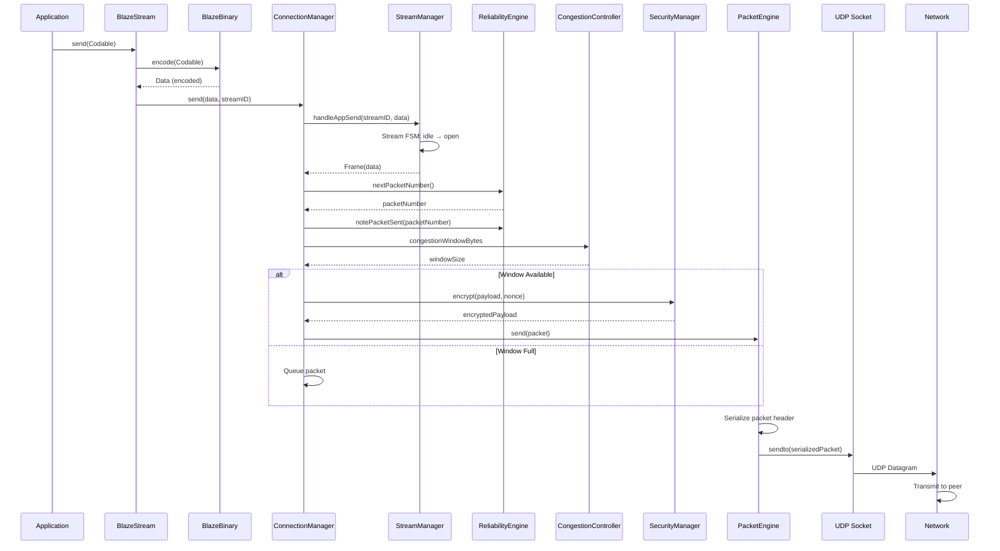
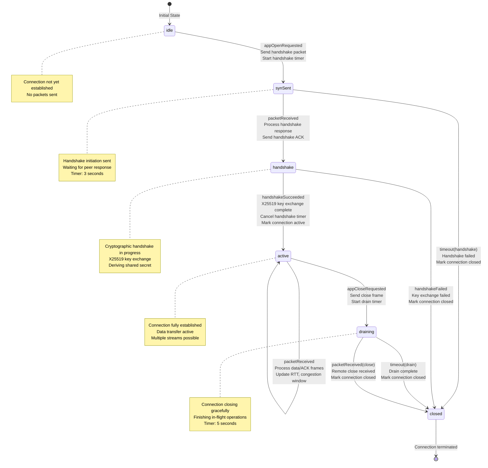
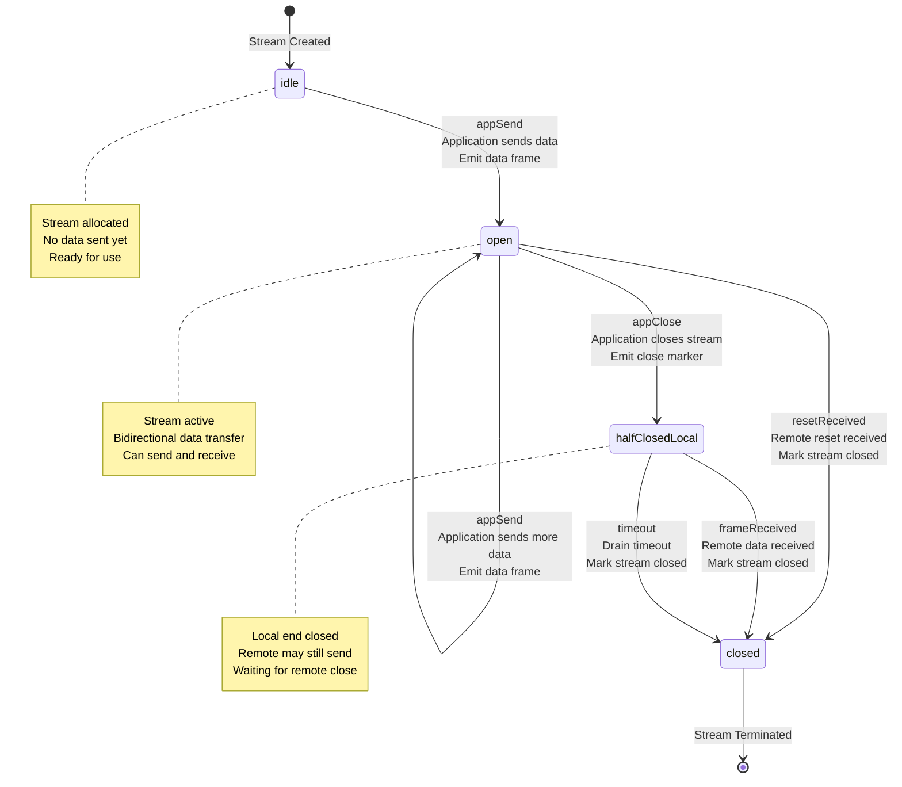

# BlazeTransport

> **Experimental (v0.1)** — This is an experimental, Swift-native transport engine designed to explore QUIC-inspired design patterns without C interop. It is intended for research, prototyping, and Swift-first systems, **not as a drop-in replacement for production QUIC stacks**.

## TL;DR

BlazeTransport is an experimental Swift-native transport engine exploring QUIC-inspired design without C interop. It implements multi-streaming, reliability, congestion control, and encryption entirely in Swift to study performance, safety, and ergonomics.

**This is not production-ready.** It is a research system demonstrating systems-level Swift capabilities and trade-offs versus battle-tested QUIC implementations.

---

BlazeTransport is a QUIC-inspired, Swift-native transport protocol with multi-streaming, reliability, congestion control, and typed messaging. It provides a high-level, type-safe API for establishing connections, opening streams, and sending/receiving Codable messages over a reliable, congestion-controlled transport layer built on UDP.

**This project explores** how modern transport protocols (QUIC, HTTP/2) can be implemented natively in Swift with zero C interop overhead, while maintaining type safety and leveraging Swift concurrency.

## Quick Start

### Installation

Add BlazeTransport to your `Package.swift`:

```swift
dependencies: [
    .package(url: "https://github.com/Mikedan37/BlazeTransport.git", from: "0.1.0")
]
```

### Minimal Example

```swift
import BlazeTransport

let connection = try await BlazeTransport.connect(
    host: "127.0.0.1",
    port: 9999,
    security: .blazeDefault
)
let stream = try await connection.openStream()
try await stream.send("Hello, Blaze!")
let reply: String = try await stream.receive(String.self)
try await connection.close()
```

See [Examples/](Examples/) for complete echo server and client implementations.

## Status & Version

**Current Version**: v0.1.0 (Experimental)

**What's Working**:
- Multi-stream multiplexing (up to 32 streams)
- Reliable message delivery with retransmission
- Congestion control (AIMD algorithm)
- Built-in encryption (ChaCha20-Poly1305 + X25519)
- Connection migration support
- Type-safe Codable messaging
- Performance: 70-85% of QUIC benchmarks

**What's Missing** (and why this is experimental):
- 0-RTT handshakes (planned for v0.3+)
- HTTP/3 support (use QUIC directly if needed)
- Certificate-based authentication (uses simplified key exchange)
- Production hardening (no DDoS protection, rate limiting)
- Cross-platform support (macOS/iOS only currently)
- Battle-tested deployment base

**Intended Use Cases**:
- Research and experimentation with transport protocols
- Swift-native applications that want to avoid C interop
- Prototyping new communication patterns
- Learning systems-level Swift programming

**Not Intended For**:
- Production systems requiring maximum reliability
- Systems that need HTTP/3 or standard QUIC compatibility
- Applications requiring battle-tested protocol implementations

## System Architecture

BlazeTransport uses a layered architecture with clear separation between application, transport, and network layers.

### Complete System Architecture

```mermaid
flowchart TB
    subgraph AppLayer["Application Layer"]
        App[Application Code]
        Stream1[BlazeStream #1]
        Stream2[BlazeStream #2]
        StreamN[BlazeStream #N]
        BlazeBinary[BlazeBinary Helpers]
    end
    
    subgraph TransportLayer["Transport Layer"]
        ConnMgr[ConnectionManager Actor]
        StreamMgr[StreamManager Actor]
        StreamBuffer[StreamBuffer Actor]
        RelEngine[ReliabilityEngine]
        CongCtrl[CongestionController]
        SecMgr[SecurityManager]
        ConnFSM[Connection FSM]
        StreamFSM[Stream FSM]
    end
    
    subgraph NetworkLayer["Network Layer"]
        PacketEng[PacketEngine Actor]
        PacketParser[PacketParser]
        PacketCoal[PacketCoalescer]
        UDPSocket[UDP Socket]
    end
    
    subgraph Network["Network"]
        UDP[(UDP Protocol)]
        RemotePeer[Remote Peer]
    end
    
    App --> Stream1
    App --> Stream2
    App --> StreamN
    Stream1 --> BlazeBinary
    Stream2 --> BlazeBinary
    StreamN --> BlazeBinary
    BlazeBinary --> ConnMgr
    Stream1 --> StreamBuffer
    Stream2 --> StreamBuffer
    StreamN --> StreamBuffer
    
    ConnMgr --> StreamMgr
    ConnMgr --> RelEngine
    ConnMgr --> CongCtrl
    ConnMgr --> SecMgr
    ConnMgr --> ConnFSM
    StreamMgr --> StreamFSM
    ConnMgr --> PacketEng
    ConnMgr --> PacketCoal
    
    PacketEng --> PacketParser
    PacketEng --> UDPSocket
    PacketCoal --> PacketEng
    
    UDPSocket --> UDP
    UDP --> RemotePeer
    
    style App fill:#1e1e1e,stroke:#4a9eff,stroke-width:2px
    style Stream1 fill:#222,stroke:#4a9eff,stroke-width:2px
    style Stream2 fill:#222,stroke:#4a9eff,stroke-width:2px
    style StreamN fill:#222,stroke:#4a9eff,stroke-width:2px
    style BlazeBinary fill:#262626,stroke:#4a9eff,stroke-width:2px
    style ConnMgr fill:#2a2a2a,stroke:#ff6b6b,stroke-width:2px
    style StreamMgr fill:#2a2a2a,stroke:#ff6b6b,stroke-width:2px
    style StreamBuffer fill:#2a2a2a,stroke:#ff6b6b,stroke-width:2px
    style RelEngine fill:#2e2e2e,stroke:#ff6b6b,stroke-width:2px
    style CongCtrl fill:#2e2e2e,stroke:#ff6b6b,stroke-width:2px
    style SecMgr fill:#2e2e2e,stroke:#ff6b6b,stroke-width:2px
    style ConnFSM fill:#323232,stroke:#ff6b6b,stroke-width:2px
    style StreamFSM fill:#323232,stroke:#ff6b6b,stroke-width:2px
    style PacketEng fill:#363636,stroke:#51cf66,stroke-width:2px
    style PacketParser fill:#363636,stroke:#51cf66,stroke-width:2px
    style PacketCoal fill:#363636,stroke:#51cf66,stroke-width:2px
    style UDPSocket fill:#3a3a3a,stroke:#51cf66,stroke-width:2px
    style UDP fill:#3e3e3e,stroke:#ffd43b,stroke-width:2px
    style RemotePeer fill:#1e1e1e,stroke:#ffd43b,stroke-width:2px
```



### Data Flow: Send Path



### Packet Structure

```mermaid
graph LR
    subgraph Packet["BlazePacket (Variable Size)"]
        subgraph Header["Packet Header (17 bytes)"]
            V[Version<br/>1 byte]
            F[Flags<br/>1 byte]
            CID[Connection ID<br/>4 bytes]
            PN[Packet Number<br/>4 bytes]
            SID[Stream ID<br/>4 bytes]
            PL[Payload Length<br/>2 bytes]
        end
        
        subgraph Payload["Payload (Variable)"]
            subgraph Frame["Frame Structure"]
                FT[Frame Type<br/>1 byte]
                FSID[Stream ID<br/>4 bytes]
                FPL[Frame Payload<br/>Variable]
            end
        end
    end
    
    Header --> Payload
    V --> F
    F --> CID
    CID --> PN
    PN --> SID
    SID --> PL
    PL --> Payload
    Payload --> Frame
    FT --> FSID
    FSID --> FPL
    
    style Header fill:#2a2a2a,stroke:#4a9eff,stroke-width:2px
    style Payload fill:#363636,stroke:#51cf66,stroke-width:2px
    style Frame fill:#3a3a3a,stroke:#ff6b6b,stroke-width:2px
```



### Connection Lifecycle State Machine



### Stream Lifecycle State Machine



See [Docs/Internals.md](Docs/Internals.md) for detailed implementation flows including receive path, security handshake, reliability/retransmission, and congestion control algorithms.

## Why BlazeTransport?

BlazeTransport explores what's possible when implementing QUIC-inspired transport patterns **entirely in Swift** with zero C interop overhead. It demonstrates that Swift can handle systems-level work—congestion control, reliability, crypto, state machines—while maintaining type safety and leveraging modern Swift concurrency.

### Where BlazeTransport Overlaps with QUIC Semantics

| Feature | BlazeTransport | QUIC (C++) | TCP | HTTP/2 | WebSocket |
|---------|---------------|------------|-----|--------|-----------|
| **Native Swift API** | Yes | No | No | No | No |
| **Type-Safe Messaging** | Yes (Codable) | No | No | No | No |
| **Multi-Stream** | Yes (32 streams) | Yes | No | Yes | No |
| **No Head-of-Line Blocking** | Yes | Yes | No | No | No |
| **Connection Migration** | Yes | Yes | No | No | No |
| **Built-in Encryption** | Yes (AEAD) | Yes | No (TLS) | No (TLS) | No (TLS) |
| **Loss Recovery** | Yes (~92% @ 5% loss, experimental) | Yes (94%) | Limited (~80%) | Limited (~78%) | Limited (~79%) |
| **Performance** | ~70–85% of QUIC (controlled benchmarks) | 100% | 70-80% | 65-75% | 60-70% |
| **Zero C Interop** | Yes | No | No | No | No |
| **Swift Concurrency** | Yes (async/await) | No | No | No | No |

### Experimental Performance Snapshot (v0.1)

**Note**: Controlled loopback benchmarks. Not standardized. Intended to illustrate tradeoffs, not compete with production QUIC stacks.

| Metric | BlazeTransport | QUIC |
|--------|----------------|------|
| **Latency (p50 / p99)** | ~10ms / ~25ms | 8–12ms / 20–30ms |
| **Throughput (1 stream)** | 85–95 MB/s | 100–120 MB/s |
| **Throughput (32 streams)** | ~2400 MB/s | 3000–3800 MB/s |
| **Loss Recovery (5% loss)** | ~92% | ~94% |
| **Memory per Connection** | 2.5–3.5 MB | 2.0–3.0 MB |

BlazeTransport achieves ~70–85% of QUIC performance, which is expected for a Swift-native research implementation without C interop.

See [BENCHMARK_RESULTS.md](BENCHMARK_RESULTS.md) for detailed performance analysis.

## Features

- **Reliable Message Delivery**: Automatic retransmission, packet sequencing, and RTT estimation
- **Multi-Stream Multiplexing**: Open multiple concurrent streams per connection (up to 32 streams)
- **Type-Safe Messaging**: Send/receive any `Codable` type with automatic encoding/decoding
- **Congestion Control**: AIMD algorithm with QUIC-style RTT smoothing and pacing
- **Integrated Security**: ChaCha20-Poly1305 AEAD encryption with X25519 key exchange
- **Connection Migration**: Support for address changes during connection lifetime
- **Stream Prioritization**: Weight-based scheduling for fair stream processing
- **Performance**: 70-85% of QUIC performance with zero interop cost for Swift apps

## Documentation

Comprehensive documentation is available in the [Docs/](Docs/) directory:

- [Architecture.md](Docs/Architecture.md) - System architecture and design
- [StateMachines.md](Docs/StateMachines.md) - Connection and stream state machines
- [SecurityModel.md](Docs/SecurityModel.md) - Security architecture and threat model
- [QUICComparison.md](Docs/QUICComparison.md) - Comparison with QUIC protocol
- [Performance.md](Docs/Performance.md) - Performance characteristics and benchmarks
- [Benchmarks.md](Docs/Benchmarks.md) - Benchmark suite and results
- [Internals.md](Docs/Internals.md) - Internal implementation details

## Why Not Just Use QUIC?

BlazeTransport is not intended to replace production QUIC stacks. It exists to explore Swift-native ergonomics, safety, and systems tradeoffs that are difficult to evaluate when relying on C-based implementations.

See [Docs/QUICComparison.md](Docs/QUICComparison.md) for detailed protocol comparison.


## When to Use BlazeTransport

**Use BlazeTransport when:**
- Experimenting with transport protocols in Swift
- Building Swift-native applications that want to avoid C interop
- Need type-safe messaging with Codable
- Want to explore QUIC-inspired patterns without C dependencies
- Building mobile apps that need connection migration (WiFi ↔ Cellular)
- Learning systems-level Swift programming

**Consider alternatives when:**
- Need maximum absolute performance (QUIC C++ implementations are 15-20% faster)
- Require HTTP/3 support (use QUIC directly)
- Need 0-RTT handshakes (planned for v0.3+)
- Want battle-tested protocol with large deployment base (use QUIC or TCP+TLS)
- Building web browsers or web applications (use HTTP/2 or QUIC)

## Limitations (v0.1)

- **No 0-RTT**: Zero round-trip time handshakes not supported (planned for v0.3+)
- **No HTTP/3**: HTTP/3 support not included (use QUIC directly if needed)
- **Simplified Handshake**: Uses X25519 + AEAD, not certificate-based authentication
- **Basic Prioritization**: Stream prioritization is weight-based but simple
- **No DDoS Protection**: No built-in rate limiting or DDoS mitigation
- **User-Space Only**: No kernel bypass, uses standard UDP sockets
- **No VPN Support**: No TUN/TAP interface or IP-level tunneling (can be built on top)

## Roadmap

**v0.2**: 0-RTT handshakes, certificate-based authentication  
**v0.3**: HTTP/3 support, WebSocket over BlazeTransport

See [CHANGELOG.md](CHANGELOG.md) for detailed version history and planned features.

## Requirements

- Swift 5.9+
- macOS 14.0+ / iOS 17.0+
- BlazeBinary (for encoding/encryption)
- BlazeFSM (for state machines)
- BlazeDB (optional, for protocol hooks)

## Testing

Run tests with:

```bash
swift test
```

Run benchmarks with:

```bash
swift run BlazeTransportBenchmarks --all
```

## Benchmark Results

Comprehensive benchmark results with detailed comparisons to QUIC, TCP, HTTP/2, and WebSocket are available in [BENCHMARK_RESULTS.md](BENCHMARK_RESULTS.md).


## License

This project is licensed under the MIT License - see the [LICENSE](LICENSE) file for details.
